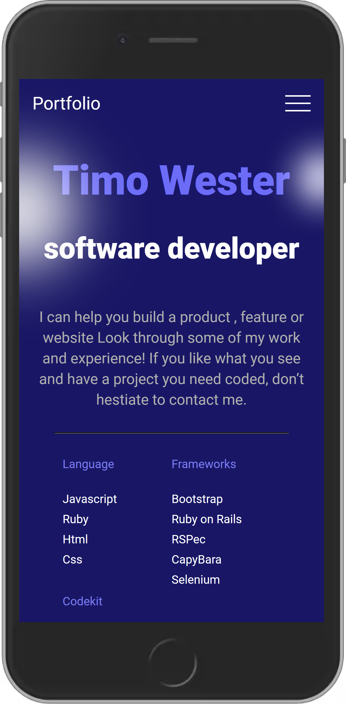

# Project Name

> Mobile portfolio page

This is my Portfolio

## Built With

- HTML
- CSS
- Nodejs
- NPM

## Live Demo

[Live Demo Link](https://livedemo.com)

## Getting Started

If you want to use this portfolio as a template you are free to do so, Just follow the instruction below

### Usage

download it directly by zip, open the index file in a text editor and you can change the content to match your own.

## Authors

👤 **Author1**

- GitHub: [@githubhandle](https://github.com/Timowest12)
- Twitter: [@twitterhandle](https://twitter.com/Timo61060367)
- LinkedIn: [LinkedIn](https://www.linkedin.com/in/timo-wester-6a0282a7/)

## 🤝 Contributing

Contributions, issues, and feature requests are welcome!

Feel free to check the [issues page](../../issues/).

## Show your support

Give a ⭐️ if you like this project!

## 📝 License

This project is [MIT](./MIT.md) licensed.
